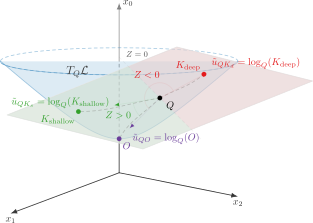
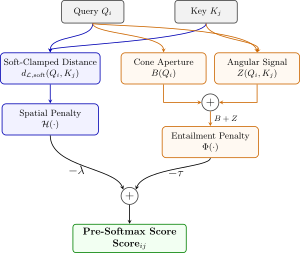

# Hyperbolic Asymmetric Attention in the Lorentz Manifold for Vision Transformers

**Federico Forner** | Bachelor's thesis, Sapienza University of Rome, Academic Year 2025/2026<br>
Supervisor: Prof. Fabio Galasso | Co-advisor: Guido Maria D'Amely di Melendugno

This project extends [HexFormer](https://github.com/HayaAlyoussef/HexFormer), a Vision Transformer whose representations and attention computations operate on the Lorentz manifold. It introduces Hyperbolic Asymmetric Attention (HAA), a directional attention score that combines geodesic compatibility with hierarchical angular information derived from hyperbolic entailment cones.

The work covers the mechanism design, auxiliary training mechanisms, geometric telemetry, and a systematic CIFAR-100 study. The study compares one re-trained HexFormer baseline with **20 directional configurations**.

The best HAA configuration reaches **76.56% top-1 accuracy**, compared with **75.49%** for the re-trained HexFormer baseline, an improvement of **+1.07 percentage points**. The ablations also show that important geometric properties can be actively shaped during training, while the configurations with the strongest classification and strongest individual geometric behavior do not always coincide.

| Study | Re-trained baseline | Best directional configuration | Improvement |
|---|---:|---:|---:|
| CIFAR-100, baseline + 20 HAA configurations | 75.49% | **76.56%** | **+1.07 pp** |

For complete derivations, the full C1-C20 study, and implementation and reproducibility details, see the [Technical Overview](docs/technical_overview.md).

## 1. Motivation and approach

Hyperbolic space is well suited to hierarchical representations because the available volume grows exponentially with radial distance. Points near the origin can represent broad concepts, while increasing radial depth can represent progressively more specific concepts.

HexFormer provides the Lorentz Vision Transformer backbone used in this project. Its baseline query-key compatibility is based on Lorentz distance. Geometric proximity is useful, but distance alone does not explicitly encode whether a relation follows a general-to-specific direction.

Hyperbolic entailment cones, introduced by Ganea, Becigneul, and Hofmann in 2018, represent directed hierarchical relations through a depth-dependent cone attached to each point. HAA adapts this prior geometric construction to Lorentz self-attention. For each query, it measures both proximity to a key and whether the key lies in the forward direction.

Before introducing HAA, a layer-wise Phase-0 analysis examined whether the trained baseline already contained enough radial and directional structure to support such a relation. No layer jointly satisfied the required criteria. This diagnosis motivated both the directional score and the training mechanisms used to shape the geometry.

## 2. Hyperbolic Asymmetric Attention

### Angular signal Z

Let $Q_i$ be a query, $K_j$ a key, and $O=(\sqrt{K},0,\ldots,0)$ the Lorentz origin for curvature $-1/K$. At $Q_i$, HAA compares the tangent direction toward $K_j$ with the tangent direction back toward $O$:

\[
Z(Q_i,K_j)
=
\frac{\left\langle \log_{Q_i}(K_j),\log_{Q_i}(O)\right\rangle_{\mathcal L}}
{\left\|\log_{Q_i}(K_j)\right\|_{\mathcal L}
 \left\|\log_{Q_i}(O)\right\|_{\mathcal L}}.
\]

A negative value means that the direction from the query toward the key points away from the origin, toward greater radial depth. A positive value points back toward shallower representations.



### Cone aperture B

The entailment cone associated with a query depends on its radial depth. Shallow, general representations receive broader cones; deep, specific representations receive narrower cones. HAA retains this principle from the hyperbolic entailment-cone construction of Ganea et al. and expresses the cone boundary through $B(Q_i)$, the cosine of its aperture.

### Directional condition

A query-key pair satisfies the directional cone condition when

\[
B(Q_i)+Z(Q_i,K_j)\leq 0.
\]

The condition combines angular direction with the query's depth-dependent aperture. For valid non-degenerate pairs, satisfying it also implies the intended ordering in which the key is deeper than the query.

### Final HAA score

The pre-softmax compatibility is

\[
\operatorname{Score}_{ij}
=
-\lambda\,\mathcal H\!\left(d_{\mathcal L,\mathrm{soft}}(Q_i,K_j)\right)
-\tau\,\Phi\!\left(B(Q_i)+Z(Q_i,K_j)\right).
\]

The first component is a spatial term based on a stabilized Lorentz distance. The second is an entailment term that distinguishes the forward hierarchical direction from the reverse direction. The positive weights $\lambda$ and $\tau$ control their relative influence.



### What changes relative to HexFormer

The core HAA modification is the attention compatibility score. Auxiliary objectives, depth-control mechanisms, and geometric telemetry are experimental and training additions used to determine when the desired geometry forms. They are not all part of the formal definition of HAA.

## 3. Contributions and key findings

- A directional Lorentz attention formulation that combines distance-based spatial compatibility with angular entailment geometry.

- A depth-aware membership rule, $B+Z\leq 0$, with an intrinsic deeper-key implication and a smooth, learnable cone aperture in the maintained implementation.

- A best CIFAR-100 result of **76.56% top-1**, improving the re-trained HexFormer baseline at 75.49% by **+1.07 percentage points**.

- A systematic empirical characterization comprising the baseline and 20 directional configurations, organized around score placement, metric learning, angular alignment, cone occupancy, depth control, and aperture ablations.

- Targeted objectives and architectural controls shape angular alignment, cone occupancy, and radial dispersion during training.

- The runs with the best classification accuracy, strongest negative angular alignment, and non-collapsed cone occupancy are different, showing that these properties need not improve together.

## 4. Results

The thesis study contains one re-trained HexFormer baseline and 20 directional HAA configurations, C1-C20. The table below highlights the runs that most clearly mark the experimental progression.

| Run | Role | Main mechanisms | Best top-1 | Main observation |
|---|---|---|---:|---|
| Baseline | Reference | HexFormer distance compatibility | 75.49% | Re-trained comparison point |
| C3 | Score-only control | Terminal-layer HAA score | 75.41% | Accuracy returns close to baseline, but the desired geometry does not form |
| **C9** | Best classification | Angular objective, frozen prototypes, radial variance, CLS-depth residual | **76.56%** | Highest accuracy, +1.07 pp over baseline; final mean $Z\approx+0.342$ |
| C12 | Angular alignment | Angular objective, frozen prototypes, bounded CLS-depth residual | 76.37% | Second-best accuracy; sustained negative angular alignment, final $Z\approx-0.080$ |
| C17 | Non-collapsed occupancy | Cone occupancy, spread, per-head query-depth scaling | 75.77% | Cone occupancy $\approx11.7\%$ with preserved radial variation; final $Z\approx+0.415$ |

### Classification

C9 reaches **76.56%**, the highest result in the study and **+1.07 percentage points** above the 75.49% baseline.

### Geometric control

C12 and C17 demonstrate different forms of geometric control. C12 reaches 76.37%, only 0.19 percentage points below C9, while sustaining a negative mean angular signal. C17 obtains approximately 11.7% cone occupancy without the radial collapse seen in several occupancy-focused runs, although its mean angular signal remains positive.

### Geometry and accuracy

C9 gives the strongest classification result, C12 the clearest sustained angular alignment, and C17 substantial non-collapsed cone occupancy. These outcomes occur in different configurations. Together, these runs show that individual geometric properties can be controlled, but no single configuration realizes all target properties simultaneously.

## 5. Repository and reproducibility

### Documentation

[Read the Technical Overview](docs/technical_overview.md) for the mathematical formulation, Phase-0 diagnosis, auxiliary objectives, diagnostics, complete C1-C20 study, limitations, and the distinction between thesis-time experiments and maintained public presets.

### Quick start

The supported execution path is CUDA. Install the pinned Python dependencies before launching training.

```bash
git clone https://github.com/Fede2717/Hyperbolic-Asymmetric-Attention.git
cd Hyperbolic-Asymmetric-Attention
python -m pip install -r requirements.txt
```

CIFAR-100 is downloaded through `torchvision` when the training split is first requested. Dataset, output, and TensorBoard locations are configurable.

### Curated configurations

The 20 directional configurations belong to the thesis study. The public repository provides five maintained entry points rather than archival files for every C1-C20 run:

- `classification_vit/config/cifar100_baseline.txt`
- `classification_vit/config/cifar100_terminal_score_only.txt`
- `classification_vit/config/cifar100_c9_current_analogue.txt`
- `classification_vit/config/cifar100_c12_current_analogue.txt`
- `classification_vit/config/cifar100_c17_equivalent.txt`

The baseline preset is aligned with the thesis baseline apart from portable path and infrastructure settings. The directional presets provide maintained entry points for representative mechanism combinations from the thesis study.

### Running experiments

Baseline:

```bash
python classification_vit/train.py \
  --config_file classification_vit/config/cifar100_baseline.txt
```

Representative HAA run:

```bash
python classification_vit/train.py \
  --config_file classification_vit/config/cifar100_c17_equivalent.txt
```

Command-line arguments override values loaded from a config file. For example:

```bash
python classification_vit/train.py \
  --config_file classification_vit/config/cifar100_c17_equivalent.txt \
  --data_root /path/to/cifar100 \
  --output_dir output/c17 \
  --log_dir logs/c17 \
  --deep_diagnostics
```

Evaluation-only mode requires an explicit checkpoint through `--load_checkpoint`.

### TensorBoard and diagnostics

HAA runs record geometric telemetry alongside classification metrics. Optional scheduled deep diagnostics are enabled with `--deep_diagnostics`. TensorBoard is the documented logging workflow:

```bash
tensorboard --logdir logs
```

The standalone `run_phase_0.py` utility provides a portable layer-wise baseline diagnosis and writes its measurements and plot to a chosen output directory. Its exact use and its distinction from ordinary model evaluation are described in the technical overview.

### Repository structure

```text
classification_vit/
  config/                  Maintained CIFAR-100 entry points
  models/                  Classification model assembly
  train.py                 Training and evaluation entry point
  haa_auxiliary_loss.py    Geometric and metric-learning objectives
  haa_diagnostics.py       HAA telemetry and deep diagnostics
lib/
  lorentz/                 Lorentz manifold operations and attention blocks
  models/ViT.py            Vision Transformer backbone
docs/
  technical_overview.md    Technical research companion
run_phase_0.py             Portable Phase-0 diagnostic utility
requirements.txt
LICENSE
```

## 6. Prior work and attribution

### HexFormer

This repository is a fork of [HexFormer](https://github.com/HayaAlyoussef/HexFormer). HexFormer supplies the Lorentz Vision Transformer backbone, including its hyperbolic patch embedding, transformer components, exponential-map aggregation, and classifier structure. The upstream baseline commit used for this project is `133ee3e935958732e891edf103f8150412365354`.

The corresponding work is:

Haya Alyoussef, Ahmad Bdeir, Diego Coello de Portugal Mecke, Tom Hanika, Niels Landwehr, and Lars Schmidt-Thieme. "HexFormer: Hyperbolic Vision Transformer with Exponential Map Aggregation." ICLR, 2026.

### Hyperbolic Entailment Cones

Hyperbolic entailment cones are pre-existing prior work:

Octavian-Eugen Ganea, Gary Bécigneul, and Thomas Hofmann. "Hyperbolic Entailment Cones for Learning Hierarchical Embeddings." Proceedings of the 35th International Conference on Machine Learning, PMLR 80, 2018.

HAA builds on HexFormer's Lorentz Vision Transformer and on this earlier geometric construction for directed hierarchy. The thesis adapts the cone formulation to Lorentz self-attention and develops the training controls and diagnostics used to study it in image classification.

## 7. Scope

The completed experimental evidence is on CIFAR-100. A larger tieredImageNet experiment was prepared but not completed because of infrastructure and I/O constraints, so no tieredImageNet result is reported.

## 8. Thesis

**Hyperbolic Asymmetric Attention in the Lorentz Manifold for Vision Transformers**

Federico Forner, Bachelor's thesis, Sapienza University of Rome, Academic Year 2025/2026.<br>
Supervisor: Prof. Fabio Galasso. Co-advisor: Guido Maria D'Amely di Melendugno.

## 9. License

This repository retains the upstream [MIT License](LICENSE) and its existing attribution.
